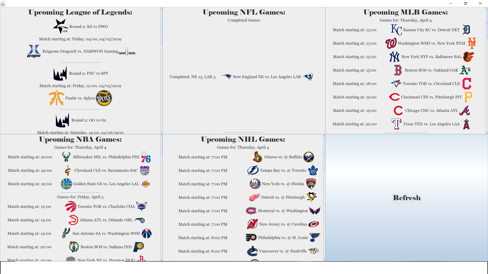

# What's On

What's On is a simple app written in Java which displays the upcoming matches in multiple sports, including League of Legends, NFL, NBA, MLB, NHL. 

The League of Legends schedule is obtained from the PandaScore API, and the major sports schedules are obtained from their respective ESPN schedules websites. 

